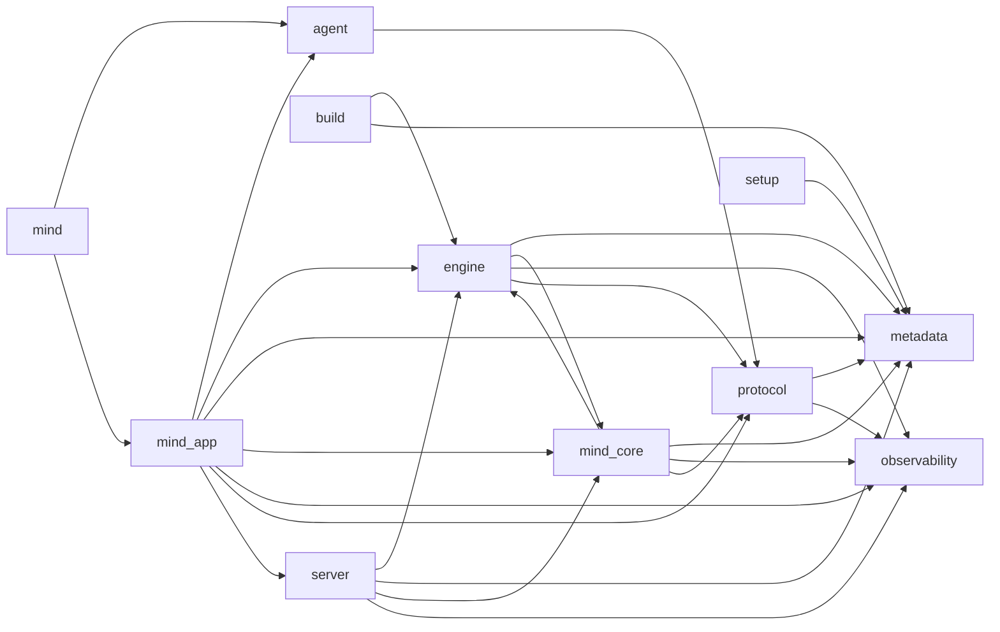

# Agent Harness 第一方导入图

> 由 `scripts/agent_runtime_import_graph.py` 根据当前源码生成，请勿手工编辑。

## 范围

- 包含生产与构建边界：`agent`、`applications`、`build`、`engine`、`metadata`、`mind`、`mind_app`、`mind_core`、`mind_npm`、`observability`、`protocol`、`server`、`setup`。
- 仅记录第一方边界之间的绝对 Python 导入；包内相对导入不展开。
- `backend/` 按独立打包边界单独验收，不纳入本图。
- `tests/`、`website/`、`schematic/`、`codex-main/` 和 `venv/` 不是运行时边界，不纳入本图。
- 根目录 `server/` 是客户端内置的 `ConfigServiceRuntime`，只提供配置 UI/健康检查；它不是 `mind.chat` 线上服务端，也不拥有 Harness 状态。

## 边界图



## 直接跨边界依赖

| 源边界 | 目标边界 | 导入文件数 | 导入语句数 | 证据文件 |
| --- | --- | ---: | ---: | --- |
| `agent` | `protocol` | 2 | 8 | `agent/adapters/protocol_client.py`<br>`agent/capabilities/environment.py` |
| `build` | `engine` | 1 | 2 | `build.py` |
| `build` | `metadata` | 1 | 1 | `build.py` |
| `engine` | `metadata` | 3 | 3 | `engine/encoding.py`<br>`engine/file_assist.py`<br>`engine/manage.py` |
| `engine` | `mind_core` | 1 | 1 | `engine/enhance/handlers.py` |
| `engine` | `observability` | 3 | 3 | `engine/enhance/handlers.py`<br>`engine/manage.py`<br>`engine/upgrade.py` |
| `engine` | `protocol` | 3 | 4 | `engine/enhance/handlers.py`<br>`engine/manage.py`<br>`engine/upgrade.py` |
| `mind` | `agent` | 1 | 1 | `mind.py` |
| `mind` | `mind_app` | 1 | 1 | `mind.py` |
| `mind_app` | `agent` | 19 | 19 | `mind_app/cli/bootstrap.py`<br>`mind_app/cli/dispatch.py`<br>`mind_app/cli/entry.py`<br>`mind_app/mcp/server.py`<br>`mind_app/native_coding/exec/process_session.py`<br>`mind_app/native_coding/native_coding.py`<br>`mind_app/runtime/environment/coding_lifecycle.py`<br>`mind_app/runtime/environment/snapshot.py`<br>`mind_app/runtime/mcp/service_lifecycle.py`<br>`mind_app/runtime/tools/client_call.py`<br>`mind_app/runtime/turns/root.py`<br>`mind_app/runtime/turns/stream.py`<br>`mind_app/runtime/turns/stream_effects.py`<br>`mind_app/runtime/turns/stream_model.py`<br>`mind_app/subscription/forwarding.py`<br>`mind_app/subscription/runtime.py`<br>`mind_app/tui/features/conversation.py`<br>`mind_app/tui/session/loop.py`<br>`mind_app/tui/session/turn_input.py` |
| `mind_app` | `engine` | 23 | 34 | `mind_app/assets.py`<br>`mind_app/attach.py`<br>`mind_app/cli/bootstrap.py`<br>`mind_app/cli/dispatch.py`<br>`mind_app/cli/doctor.py`<br>`mind_app/cli/entry.py`<br>`mind_app/cli/frontend.py`<br>`mind_app/cli/mcp_registry.py`<br>`mind_app/cli/session_archive.py`<br>`mind_app/controller.py`<br>`mind_app/mcp/group.py`<br>`mind_app/paths.py`<br>`mind_app/runtime/mcp/external.py`<br>`mind_app/runtime/mcp/keepalive.py`<br>`mind_app/runtime/mcp/service_lifecycle.py`<br>`mind_app/runtime/mcp/service_runtime.py`<br>`mind_app/runtime/tools/run.py`<br>`mind_app/subscription/forwarding.py`<br>`mind_app/tui/features/helix.py`<br>`mind_app/tui/features/listener.py`<br>`mind_app/tui/features/mailbox.py`<br>`mind_app/tui/session/barriers.py`<br>`mind_app/tui/session/dispatch.py` |
| `mind_app` | `metadata` | 49 | 49 | `mind_app/approval/permission_grants.py`<br>`mind_app/approval/policy.py`<br>`mind_app/cli/arguments.py`<br>`mind_app/cli/bootstrap.py`<br>`mind_app/cli/completion.py`<br>`mind_app/cli/doctor.py`<br>`mind_app/cli/frontend.py`<br>`mind_app/cli/invocation.py`<br>`mind_app/cli/parser.py`<br>`mind_app/frontend/sinks.py`<br>`mind_app/history/transcript.py`<br>`mind_app/mcp/config.py`<br>`mind_app/mcp/server.py`<br>`mind_app/native_coding/base.py`<br>`mind_app/native_coding/edit/diagnostics.py`<br>`mind_app/native_coding/edit/diff_render.py`<br>`mind_app/native_coding/edit/operations.py`<br>`mind_app/native_coding/edit/planning.py`<br>`mind_app/native_coding/encoding.py`<br>`mind_app/native_coding/exec/exec_policy.py`<br>`mind_app/native_coding/exec/execpolicy/parser.py`<br>`mind_app/native_coding/js_repl/runtime.py`<br>`mind_app/output/text.py`<br>`mind_app/paths.py`<br>`mind_app/presentation/code_highlight.py`<br>`mind_app/reporting.py`<br>`mind_app/runtime/agent/client.py`<br>`mind_app/runtime/hooks/command.py`<br>`mind_app/runtime/hooks/output_spill.py`<br>`mind_app/runtime/hooks/tool.py`<br>`mind_app/runtime/mcp/keepalive.py`<br>`mind_app/runtime/mcp/local.py`<br>`mind_app/runtime/mcp/service_exec_env.py`<br>`mind_app/runtime/support/clipboard.py`<br>`mind_app/runtime/support/session_policy.py`<br>`mind_app/runtime/tools/client_call.py`<br>`mind_app/stream_events/approval_trace.py`<br>`mind_app/stream_io/output_record.py`<br>`mind_app/subscription/opening.py`<br>`mind_app/subscription/runtime.py`<br>`mind_app/tui/adapters/application.py`<br>`mind_app/tui/core/styles.py`<br>`mind_app/tui/features/conversation.py`<br>`mind_app/tui/features/helix.py`<br>`mind_app/tui/features/permissions.py`<br>`mind_app/tui/features/tools.py`<br>`mind_app/tui/features/transcript_export.py`<br>`mind_app/tui/rendering/screen/surfaces.py`<br>`mind_app/tui/session/turn.py` |
| `mind_app` | `mind_core` | 72 | 121 | `mind_app/cli/bootstrap.py`<br>`mind_app/cli/commands.py`<br>`mind_app/cli/dispatch.py`<br>`mind_app/cli/doctor.py`<br>`mind_app/cli/entry.py`<br>`mind_app/cli/frontend.py`<br>`mind_app/cli/invocation.py`<br>`mind_app/cli/mcp_registry.py`<br>`mind_app/client_tools/registry.py`<br>`mind_app/controller.py`<br>`mind_app/mcp/registry.py`<br>`mind_app/mcp/server.py`<br>`mind_app/native_coding/exec/exec_policy.py`<br>`mind_app/native_coding/exec/sandbox_client.py`<br>`mind_app/native_coding/js_repl/runtime.py`<br>`mind_app/native_coding/native_coding.py`<br>`mind_app/paths.py`<br>`mind_app/presentation/mcp_status.py`<br>`mind_app/presentation/renderers/dispatch.py`<br>`mind_app/presentation/renderers/patch.py`<br>`mind_app/presentation/run_views.py`<br>`mind_app/runtime/conversation.py`<br>`mind_app/runtime/environment/coding_lifecycle.py`<br>`mind_app/runtime/execution.py`<br>`mind_app/runtime/hooks/catalog.py`<br>`mind_app/runtime/hooks/command.py`<br>`mind_app/runtime/hooks/compact.py`<br>`mind_app/runtime/hooks/effects.py`<br>`mind_app/runtime/hooks/events.py`<br>`mind_app/runtime/hooks/matching.py`<br>`mind_app/runtime/hooks/models.py`<br>`mind_app/runtime/hooks/protocol.py`<br>`mind_app/runtime/hooks/registry.py`<br>`mind_app/runtime/hooks/runtime.py`<br>`mind_app/runtime/hooks/scope.py`<br>`mind_app/runtime/hooks/session.py`<br>`mind_app/runtime/subagents/context.py`<br>`mind_app/runtime/subagents/graph.py`<br>`mind_app/runtime/subagents/runtime.py`<br>`mind_app/runtime/subagents/thread.py`<br>`mind_app/runtime/turns/root.py`<br>`mind_app/runtime/turns/stream_presentation.py`<br>`mind_app/runtime/turns/stream_setup.py`<br>`mind_app/tui/adapters/application.py`<br>`mind_app/tui/adapters/presentation.py`<br>`mind_app/tui/core/activity.py`<br>`mind_app/tui/core/approval.py`<br>`mind_app/tui/core/approval_render.py`<br>`mind_app/tui/core/input.py`<br>`mind_app/tui/core/runtime.py`<br>`mind_app/tui/core/screen.py`<br>`mind_app/tui/core/status_frames.py`<br>`mind_app/tui/core/styles.py`<br>`mind_app/tui/core/viewport.py`<br>`mind_app/tui/features/context.py`<br>`mind_app/tui/features/conversation.py`<br>`mind_app/tui/features/helix.py`<br>`mind_app/tui/features/history.py`<br>`mind_app/tui/features/hooks.py`<br>`mind_app/tui/features/listener.py`<br>`mind_app/tui/features/mailbox.py`<br>`mind_app/tui/features/mcp.py`<br>`mind_app/tui/features/model.py`<br>`mind_app/tui/features/permissions.py`<br>`mind_app/tui/features/skills.py`<br>`mind_app/tui/prompting/commands.py`<br>`mind_app/tui/prompting/skills.py`<br>`mind_app/tui/rendering/screen/terminal.py`<br>`mind_app/tui/runtime/ports.py`<br>`mind_app/tui/session/dispatch.py`<br>`mind_app/tui/session/state.py`<br>`mind_app/tui/session/turn.py` |
| `mind_app` | `observability` | 52 | 53 | `mind_app/approval/coordinator.py`<br>`mind_app/cli/bootstrap.py`<br>`mind_app/cli/dispatch.py`<br>`mind_app/cli/entry.py`<br>`mind_app/controller.py`<br>`mind_app/history/transcript.py`<br>`mind_app/mcp/group.py`<br>`mind_app/mcp/session_adapter.py`<br>`mind_app/mcp/tools.py`<br>`mind_app/native_coding/exec/process_session.py`<br>`mind_app/native_coding/exec/shell_exec.py`<br>`mind_app/reporting.py`<br>`mind_app/runtime/conversation.py`<br>`mind_app/runtime/environment/snapshot.py`<br>`mind_app/runtime/hooks/registry.py`<br>`mind_app/runtime/hooks/runtime.py`<br>`mind_app/runtime/hooks/session.py`<br>`mind_app/runtime/mcp/external.py`<br>`mind_app/runtime/mcp/keepalive.py`<br>`mind_app/runtime/mcp/local.py`<br>`mind_app/runtime/mcp/service_exec_env.py`<br>`mind_app/runtime/mcp/service_lifecycle.py`<br>`mind_app/runtime/mcp/service_runtime.py`<br>`mind_app/runtime/mcp/tool_runtime.py`<br>`mind_app/runtime/subagents/control.py`<br>`mind_app/runtime/subagents/delivery.py`<br>`mind_app/runtime/subagents/graph.py`<br>`mind_app/runtime/subagents/runner.py`<br>`mind_app/runtime/subagents/runtime.py`<br>`mind_app/runtime/tools/client_call.py`<br>`mind_app/runtime/tools/notify.py`<br>`mind_app/runtime/tools/plan_steps.py`<br>`mind_app/runtime/tools/run.py`<br>`mind_app/runtime/turns/executor.py`<br>`mind_app/runtime/turns/stream.py`<br>`mind_app/runtime/turns/stream_approval.py`<br>`mind_app/runtime/turns/stream_finalize.py`<br>`mind_app/runtime/turns/stream_setup.py`<br>`mind_app/runtime/turns/stream_tools.py`<br>`mind_app/stream_io/output_record.py`<br>`mind_app/subscription/external_access.py`<br>`mind_app/subscription/forwarding.py`<br>`mind_app/subscription/loop.py`<br>`mind_app/subscription/opening.py`<br>`mind_app/subscription/runtime.py`<br>`mind_app/subscription/status.py`<br>`mind_app/subscription/ws.py`<br>`mind_app/tui/features/conversation.py`<br>`mind_app/tui/prompting/files.py`<br>`mind_app/tui/session/barriers.py`<br>`mind_app/tui/session/turn.py`<br>`mind_app/tui/session/turn_input.py` |
| `mind_app` | `protocol` | 43 | 71 | `mind_app/approval/models.py`<br>`mind_app/approval/policy.py`<br>`mind_app/builtin_tools/permissions.py`<br>`mind_app/cli/bootstrap.py`<br>`mind_app/client_tools/coding/native.py`<br>`mind_app/controller.py`<br>`mind_app/mcp/server.py`<br>`mind_app/presentation/approval_views.py`<br>`mind_app/runtime/agent/client.py`<br>`mind_app/runtime/conversation.py`<br>`mind_app/runtime/execution.py`<br>`mind_app/runtime/mcp/local.py`<br>`mind_app/runtime/subagents/control.py`<br>`mind_app/runtime/subagents/delivery.py`<br>`mind_app/runtime/subagents/executor.py`<br>`mind_app/runtime/subagents/graph.py`<br>`mind_app/runtime/subagents/mailbox.py`<br>`mind_app/runtime/subagents/runner.py`<br>`mind_app/runtime/subagents/runtime.py`<br>`mind_app/runtime/subagents/thread.py`<br>`mind_app/runtime/support/conversation.py`<br>`mind_app/runtime/tools/client_call.py`<br>`mind_app/runtime/tools/run.py`<br>`mind_app/runtime/turns/event_reporting.py`<br>`mind_app/runtime/turns/executor.py`<br>`mind_app/runtime/turns/root.py`<br>`mind_app/runtime/turns/stream.py`<br>`mind_app/runtime/turns/stream_approval.py`<br>`mind_app/runtime/turns/stream_effects.py`<br>`mind_app/runtime/turns/stream_model.py`<br>`mind_app/runtime/turns/stream_outcome.py`<br>`mind_app/runtime/turns/stream_presentation.py`<br>`mind_app/runtime/turns/stream_setup.py`<br>`mind_app/runtime/turns/stream_tools.py`<br>`mind_app/stream_events/assistant_boundary.py`<br>`mind_app/stream_events/lifecycle.py`<br>`mind_app/subscription/runtime.py`<br>`mind_app/subscription/ws.py`<br>`mind_app/tui/core/queued.py`<br>`mind_app/tui/features/conversation.py`<br>`mind_app/tui/session/loop.py`<br>`mind_app/tui/session/turn.py`<br>`mind_app/tui/session/turn_input.py` |
| `mind_app` | `server` | 3 | 3 | `mind_app/cli/bootstrap.py`<br>`mind_app/subscription/external_access.py`<br>`mind_app/tui/session/dispatch.py` |
| `mind_core` | `engine` | 1 | 2 | `mind_core/licensing.py` |
| `mind_core` | `metadata` | 11 | 11 | `mind_core/application_paths.py`<br>`mind_core/config_layers.py`<br>`mind_core/config_store.py`<br>`mind_core/design/terminal_progress.py`<br>`mind_core/hook_discovery.py`<br>`mind_core/hooks.py`<br>`mind_core/licensing.py`<br>`mind_core/preference.py`<br>`mind_core/project_trust.py`<br>`mind_core/remote_services.py`<br>`mind_core/service_config.py` |
| `mind_core` | `observability` | 4 | 4 | `mind_core/licensing.py`<br>`mind_core/preference.py`<br>`mind_core/remote_services.py`<br>`mind_core/service_config.py` |
| `mind_core` | `protocol` | 3 | 3 | `mind_core/licensing.py`<br>`mind_core/permissions.py`<br>`mind_core/remote_services.py` |
| `protocol` | `metadata` | 1 | 1 | `protocol/transport/config.py` |
| `protocol` | `observability` | 3 | 3 | `protocol/client/manifest.py`<br>`protocol/transport/events.py`<br>`protocol/transport/streaming.py` |
| `server` | `engine` | 1 | 2 | `server/lifecycle.py` |
| `server` | `metadata` | 2 | 2 | `server/page.py`<br>`server/routers/basic.py` |
| `server` | `mind_core` | 5 | 8 | `server/app.py`<br>`server/lifecycle.py`<br>`server/routers/pref.py`<br>`server/routers/services.py`<br>`server/storage.py` |
| `server` | `observability` | 1 | 1 | `server/lifecycle.py` |
| `setup` | `metadata` | 1 | 1 | `setup.py` |

## 循环与反向依赖

### 跨边界循环

- `engine -> mind_core -> engine`

### `engine` 反向依赖

- `engine -> metadata`：`engine/encoding.py`、`engine/file_assist.py`、`engine/manage.py`
- `engine -> mind_core`：`engine/enhance/handlers.py`
- `engine -> observability`：`engine/enhance/handlers.py`、`engine/manage.py`、`engine/upgrade.py`
- `engine -> protocol`：`engine/enhance/handlers.py`、`engine/manage.py`、`engine/upgrade.py`

## 复核命令

```powershell
.\venv\Scripts\python.exe scripts\agent_runtime_import_graph.py --check
```
