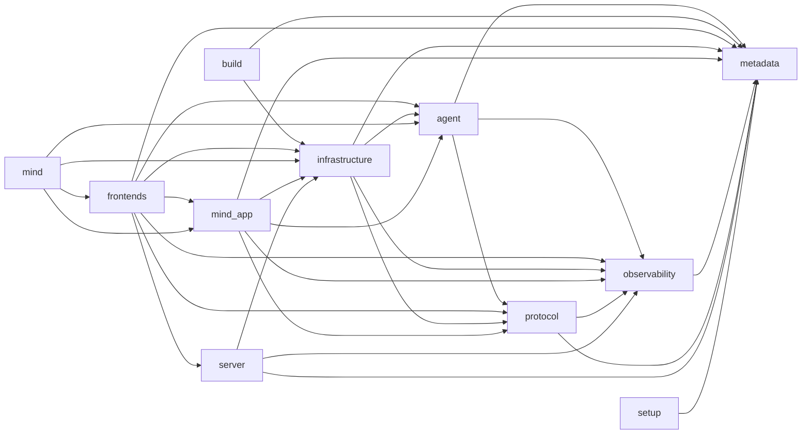

# Agent Harness 第一方导入图

> 由 `scripts/agent_runtime_import_graph.py` 根据当前源码生成，请勿手工编辑。

## 范围

- 包含生产与构建边界：`agent`、`applications`、`build`、`frontends`、`infrastructure`、`metadata`、`mind`、`mind_app`、`mind_core`、`mind_npm`、`observability`、`protocol`、`server`、`setup`。
- 仅记录第一方边界之间的绝对 Python 导入；包内相对导入不展开。
- `backend/` 按独立打包边界单独验收，不纳入本图。
- `tests/`、`website/`、`schematic/`、`codex-main/` 和 `venv/` 不是运行时边界，不纳入本图。
- 根目录 `server/` 是客户端内置的 `ConfigServiceRuntime`，只提供配置 UI/健康检查；它不是 `mind.chat` 线上服务端，也不拥有 Harness 状态。

## 边界图



## 直接跨边界依赖

| 源边界 | 目标边界 | 导入文件数 | 导入语句数 | 证据文件 |
| --- | --- | ---: | ---: | --- |
| `agent` | `metadata` | 2 | 2 | `agent/domain/hooks.py`<br>`agent/stores/approvals/permissions.py` |
| `agent` | `observability` | 7 | 7 | `agent/adapters/agents/messages.py`<br>`agent/composition.py`<br>`agent/harness/agents/control.py`<br>`agent/harness/execution/subagent_runner.py`<br>`agent/harness/hooks/registry.py`<br>`agent/harness/hooks/runtime.py`<br>`agent/stores/agents/graph.py` |
| `agent` | `protocol` | 17 | 31 | `agent/adapters/agents/execution.py`<br>`agent/adapters/agents/messages.py`<br>`agent/adapters/protocol/client.py`<br>`agent/application/agents/thread.py`<br>`agent/application/turns/context.py`<br>`agent/application/turns/execution.py`<br>`agent/capabilities/environment.py`<br>`agent/domain/agents.py`<br>`agent/domain/policies.py`<br>`agent/harness/agents/delivery.py`<br>`agent/harness/execution/subagent_runner.py`<br>`agent/harness/execution/subagent_submission.py`<br>`agent/ports/agent_messages.py`<br>`agent/ports/subagents.py`<br>`agent/ports/turns.py`<br>`agent/stores/agents/graph.py`<br>`agent/stores/agents/mailbox.py` |
| `build` | `infrastructure` | 1 | 2 | `build.py` |
| `build` | `metadata` | 1 | 1 | `build.py` |
| `frontends` | `agent` | 24 | 54 | `frontends/cli/bootstrap.py`<br>`frontends/cli/commands.py`<br>`frontends/cli/dispatch.py`<br>`frontends/cli/entry.py`<br>`frontends/mcp/server.py`<br>`frontends/subscription/forwarding.py`<br>`frontends/subscription/loop.py`<br>`frontends/subscription/runtime.py`<br>`frontends/subscription/ws.py`<br>`frontends/tui/adapters/hooks.py`<br>`frontends/tui/core/document.py`<br>`frontends/tui/features/agents.py`<br>`frontends/tui/features/conversation.py`<br>`frontends/tui/features/helix.py`<br>`frontends/tui/features/history.py`<br>`frontends/tui/features/hooks.py`<br>`frontends/tui/features/listener.py`<br>`frontends/tui/features/mailbox.py`<br>`frontends/tui/features/permissions.py`<br>`frontends/tui/features/tools.py`<br>`frontends/tui/session/loop.py`<br>`frontends/tui/session/state.py`<br>`frontends/tui/session/turn.py`<br>`frontends/tui/session/turn_input.py` |
| `frontends` | `infrastructure` | 30 | 83 | `frontends/cli/bootstrap.py`<br>`frontends/cli/commands.py`<br>`frontends/cli/dispatch.py`<br>`frontends/cli/doctor.py`<br>`frontends/cli/entry.py`<br>`frontends/cli/frontend.py`<br>`frontends/cli/invocation.py`<br>`frontends/cli/mcp_registry.py`<br>`frontends/cli/session_archive.py`<br>`frontends/mcp/server.py`<br>`frontends/subscription/forwarding.py`<br>`frontends/subscription/runtime.py`<br>`frontends/tui/core/input.py`<br>`frontends/tui/core/viewport.py`<br>`frontends/tui/features/context.py`<br>`frontends/tui/features/diff.py`<br>`frontends/tui/features/helix.py`<br>`frontends/tui/features/hooks.py`<br>`frontends/tui/features/listener.py`<br>`frontends/tui/features/mailbox.py`<br>`frontends/tui/features/model.py`<br>`frontends/tui/features/skills.py`<br>`frontends/tui/features/transcript_export.py`<br>`frontends/tui/prompting/commands.py`<br>`frontends/tui/prompting/skills.py`<br>`frontends/tui/runtime/ports.py`<br>`frontends/tui/session/barriers.py`<br>`frontends/tui/session/dispatch.py`<br>`frontends/tui/session/loop.py`<br>`frontends/tui/session/state.py` |
| `frontends` | `metadata` | 21 | 21 | `frontends/cli/arguments.py`<br>`frontends/cli/bootstrap.py`<br>`frontends/cli/completion.py`<br>`frontends/cli/doctor.py`<br>`frontends/cli/frontend.py`<br>`frontends/cli/invocation.py`<br>`frontends/cli/parser.py`<br>`frontends/mcp/server.py`<br>`frontends/subscription/client.py`<br>`frontends/subscription/opening.py`<br>`frontends/subscription/runtime.py`<br>`frontends/tui/adapters/application.py`<br>`frontends/tui/adapters/clipboard.py`<br>`frontends/tui/core/styles.py`<br>`frontends/tui/features/conversation.py`<br>`frontends/tui/features/helix.py`<br>`frontends/tui/features/permissions.py`<br>`frontends/tui/features/tools.py`<br>`frontends/tui/features/transcript_export.py`<br>`frontends/tui/rendering/screen/surfaces.py`<br>`frontends/tui/session/turn.py` |
| `frontends` | `mind_app` | 56 | 148 | `frontends/cli/bootstrap.py`<br>`frontends/cli/dispatch.py`<br>`frontends/cli/doctor.py`<br>`frontends/cli/entry.py`<br>`frontends/cli/frontend.py`<br>`frontends/cli/mcp_registry.py`<br>`frontends/cli/session_archive.py`<br>`frontends/mcp/server.py`<br>`frontends/tui/adapters/application.py`<br>`frontends/tui/adapters/content.py`<br>`frontends/tui/adapters/hooks.py`<br>`frontends/tui/adapters/markdown.py`<br>`frontends/tui/adapters/output.py`<br>`frontends/tui/adapters/presentation.py`<br>`frontends/tui/adapters/session.py`<br>`frontends/tui/adapters/status.py`<br>`frontends/tui/core/activity.py`<br>`frontends/tui/core/approval.py`<br>`frontends/tui/core/approval_render.py`<br>`frontends/tui/core/directory_trust.py`<br>`frontends/tui/core/document.py`<br>`frontends/tui/core/hyperlinks.py`<br>`frontends/tui/core/input.py`<br>`frontends/tui/core/mailbox.py`<br>`frontends/tui/core/menu.py`<br>`frontends/tui/core/process_status.py`<br>`frontends/tui/core/queued.py`<br>`frontends/tui/core/runtime.py`<br>`frontends/tui/core/screen.py`<br>`frontends/tui/core/status_frames.py`<br>`frontends/tui/core/styles.py`<br>`frontends/tui/features/agents.py`<br>`frontends/tui/features/conversation.py`<br>`frontends/tui/features/diff.py`<br>`frontends/tui/features/helix.py`<br>`frontends/tui/features/history.py`<br>`frontends/tui/features/hooks.py`<br>`frontends/tui/features/listener.py`<br>`frontends/tui/features/mailbox.py`<br>`frontends/tui/features/mcp.py`<br>`frontends/tui/features/model.py`<br>`frontends/tui/features/permissions.py`<br>`frontends/tui/features/processes.py`<br>`frontends/tui/features/shell.py`<br>`frontends/tui/features/summary.py`<br>`frontends/tui/features/tools.py`<br>`frontends/tui/rendering/menu/sanitize.py`<br>`frontends/tui/rendering/screen/surfaces.py`<br>`frontends/tui/rendering/screen/terminal.py`<br>`frontends/tui/rendering/text_sanitize.py`<br>`frontends/tui/runtime/ports.py`<br>`frontends/tui/session/barriers.py`<br>`frontends/tui/session/dispatch.py`<br>`frontends/tui/session/loop.py`<br>`frontends/tui/session/state.py`<br>`frontends/tui/session/turn.py` |
| `frontends` | `observability` | 16 | 17 | `frontends/cli/bootstrap.py`<br>`frontends/cli/dispatch.py`<br>`frontends/cli/entry.py`<br>`frontends/mcp/server.py`<br>`frontends/subscription/external_access.py`<br>`frontends/subscription/forwarding.py`<br>`frontends/subscription/loop.py`<br>`frontends/subscription/opening.py`<br>`frontends/subscription/runtime.py`<br>`frontends/subscription/status.py`<br>`frontends/subscription/ws.py`<br>`frontends/tui/features/conversation.py`<br>`frontends/tui/prompting/files.py`<br>`frontends/tui/session/barriers.py`<br>`frontends/tui/session/turn.py`<br>`frontends/tui/session/turn_input.py` |
| `frontends` | `protocol` | 11 | 16 | `frontends/cli/bootstrap.py`<br>`frontends/mcp/server.py`<br>`frontends/subscription/client.py`<br>`frontends/subscription/runtime.py`<br>`frontends/subscription/ws.py`<br>`frontends/tui/core/queued.py`<br>`frontends/tui/features/conversation.py`<br>`frontends/tui/features/history.py`<br>`frontends/tui/session/loop.py`<br>`frontends/tui/session/turn.py`<br>`frontends/tui/session/turn_input.py` |
| `frontends` | `server` | 3 | 3 | `frontends/cli/bootstrap.py`<br>`frontends/subscription/external_access.py`<br>`frontends/tui/session/dispatch.py` |
| `infrastructure` | `agent` | 9 | 12 | `infrastructure/config/execution_policy.py`<br>`infrastructure/config/execution_policy_manager.py`<br>`infrastructure/config/layers.py`<br>`infrastructure/config/schema.py`<br>`infrastructure/hooks/discovery.py`<br>`infrastructure/platform/hook_command.py`<br>`infrastructure/platform/process_sessions.py`<br>`infrastructure/services/helix_capability.py`<br>`infrastructure/services/runtime_owner.py` |
| `infrastructure` | `metadata` | 19 | 19 | `infrastructure/config/execution_policy.py`<br>`infrastructure/config/execution_policy_manager.py`<br>`infrastructure/config/layers.py`<br>`infrastructure/config/paths.py`<br>`infrastructure/config/preferences.py`<br>`infrastructure/config/runtime_paths.py`<br>`infrastructure/config/store.py`<br>`infrastructure/config/trust.py`<br>`infrastructure/hooks/discovery.py`<br>`infrastructure/platform/encoding.py`<br>`infrastructure/platform/file_assist.py`<br>`infrastructure/platform/hook_command.py`<br>`infrastructure/platform/hook_output_spill.py`<br>`infrastructure/platform/javascript_repl.py`<br>`infrastructure/services/keepalive.py`<br>`infrastructure/services/licensing.py`<br>`infrastructure/services/remote_services.py`<br>`infrastructure/services/server_manager.py`<br>`infrastructure/services/service_config.py` |
| `infrastructure` | `observability` | 10 | 10 | `infrastructure/config/preferences.py`<br>`infrastructure/platform/process_sessions.py`<br>`infrastructure/services/keepalive.py`<br>`infrastructure/services/licensing.py`<br>`infrastructure/services/remote_services.py`<br>`infrastructure/services/runtime_owner.py`<br>`infrastructure/services/runtime_setup.py`<br>`infrastructure/services/server_manager.py`<br>`infrastructure/services/service_config.py`<br>`infrastructure/update/runtime.py` |
| `infrastructure` | `protocol` | 4 | 5 | `infrastructure/services/licensing.py`<br>`infrastructure/services/remote_services.py`<br>`infrastructure/services/server_manager.py`<br>`infrastructure/update/runtime.py` |
| `mind` | `agent` | 1 | 4 | `mind.py` |
| `mind` | `frontends` | 1 | 3 | `mind.py` |
| `mind` | `infrastructure` | 1 | 6 | `mind.py` |
| `mind` | `mind_app` | 1 | 4 | `mind.py` |
| `mind_app` | `agent` | 43 | 137 | `mind_app/builtin_tools/permissions.py`<br>`mind_app/builtin_tools/registry.py`<br>`mind_app/client_tools/coding/native.py`<br>`mind_app/client_tools/registry.py`<br>`mind_app/client_tools/subagents.py`<br>`mind_app/client_tools/types.py`<br>`mind_app/controller.py`<br>`mind_app/history/transcript.py`<br>`mind_app/interaction/environment.py`<br>`mind_app/native_coding/exec/exec_command.py`<br>`mind_app/native_coding/exec/shell_exec.py`<br>`mind_app/presentation/run_views.py`<br>`mind_app/presentation/terminal/turn_lifecycle.py`<br>`mind_app/presentation/tool_policy.py`<br>`mind_app/runtime/compaction.py`<br>`mind_app/runtime/hooks/compact.py`<br>`mind_app/runtime/hooks/presentation.py`<br>`mind_app/runtime/hooks/session.py`<br>`mind_app/runtime/hooks/tool.py`<br>`mind_app/runtime/hooks/turn.py`<br>`mind_app/runtime/mcp/external.py`<br>`mind_app/runtime/mcp/service_runtime.py`<br>`mind_app/runtime/mcp/session_adapter.py`<br>`mind_app/runtime/mcp/tool_runtime.py`<br>`mind_app/runtime/mcp/tools.py`<br>`mind_app/runtime/subagents/context.py`<br>`mind_app/runtime/subagents/runtime.py`<br>`mind_app/runtime/tools/client_call.py`<br>`mind_app/runtime/tools/plan_call.py`<br>`mind_app/runtime/tools/plan_steps.py`<br>`mind_app/runtime/tools/router.py`<br>`mind_app/runtime/tools/run.py`<br>`mind_app/runtime/turns/executor.py`<br>`mind_app/runtime/turns/root.py`<br>`mind_app/runtime/turns/stream.py`<br>`mind_app/runtime/turns/stream_approval.py`<br>`mind_app/runtime/turns/stream_effects.py`<br>`mind_app/runtime/turns/stream_finalize.py`<br>`mind_app/runtime/turns/stream_model.py`<br>`mind_app/runtime/turns/stream_policy.py`<br>`mind_app/runtime/turns/stream_presentation.py`<br>`mind_app/runtime/turns/stream_setup.py`<br>`mind_app/runtime/turns/stream_tools.py` |
| `mind_app` | `infrastructure` | 22 | 47 | `mind_app/client_tools/coding/native.py`<br>`mind_app/client_tools/registry.py`<br>`mind_app/controller.py`<br>`mind_app/history/store.py`<br>`mind_app/history/transcript.py`<br>`mind_app/interaction/attachments.py`<br>`mind_app/native_coding/base.py`<br>`mind_app/native_coding/exec/exec_command.py`<br>`mind_app/native_coding/exec/shell_exec.py`<br>`mind_app/native_coding/exec/user_shell.py`<br>`mind_app/native_coding/native_coding.py`<br>`mind_app/presentation/terminal/download_renderer.py`<br>`mind_app/runtime/mcp/external.py`<br>`mind_app/runtime/mcp/group.py`<br>`mind_app/runtime/mcp/registry.py`<br>`mind_app/runtime/mcp/service_runtime.py`<br>`mind_app/runtime/tools/enhancement/handlers.py`<br>`mind_app/runtime/turns/stream.py`<br>`mind_app/runtime/turns/stream_finalize.py`<br>`mind_app/runtime/turns/stream_policy.py`<br>`mind_app/runtime/turns/stream_setup.py`<br>`mind_app/runtime/turns/stream_tools.py` |
| `mind_app` | `metadata` | 19 | 19 | `mind_app/approval/policy.py`<br>`mind_app/history/transcript.py`<br>`mind_app/native_coding/base.py`<br>`mind_app/native_coding/edit/diagnostics.py`<br>`mind_app/native_coding/edit/diff_render.py`<br>`mind_app/native_coding/edit/operations.py`<br>`mind_app/native_coding/edit/planning.py`<br>`mind_app/presentation/application_sinks.py`<br>`mind_app/presentation/code_highlight.py`<br>`mind_app/presentation/output/recording.py`<br>`mind_app/presentation/output/text.py`<br>`mind_app/presentation/stream/approval_trace.py`<br>`mind_app/presentation/stream/exception_text.py`<br>`mind_app/presentation/terminal/progress.py`<br>`mind_app/runtime/hooks/tool.py`<br>`mind_app/runtime/mcp/config.py`<br>`mind_app/runtime/mcp/local.py`<br>`mind_app/runtime/mcp/service_exec_env.py`<br>`mind_app/runtime/tools/client_call.py` |
| `mind_app` | `observability` | 27 | 29 | `mind_app/approval/coordinator.py`<br>`mind_app/controller.py`<br>`mind_app/history/transcript.py`<br>`mind_app/interaction/environment.py`<br>`mind_app/native_coding/exec/shell_exec.py`<br>`mind_app/presentation/output/recording.py`<br>`mind_app/runtime/compaction.py`<br>`mind_app/runtime/hooks/session.py`<br>`mind_app/runtime/mcp/external.py`<br>`mind_app/runtime/mcp/group.py`<br>`mind_app/runtime/mcp/local.py`<br>`mind_app/runtime/mcp/service_exec_env.py`<br>`mind_app/runtime/mcp/service_runtime.py`<br>`mind_app/runtime/mcp/session_adapter.py`<br>`mind_app/runtime/mcp/tool_progress.py`<br>`mind_app/runtime/mcp/tool_runtime.py`<br>`mind_app/runtime/mcp/tools.py`<br>`mind_app/runtime/tools/client_call.py`<br>`mind_app/runtime/tools/enhancement/handlers.py`<br>`mind_app/runtime/tools/plan_steps.py`<br>`mind_app/runtime/tools/run.py`<br>`mind_app/runtime/turns/executor.py`<br>`mind_app/runtime/turns/stream.py`<br>`mind_app/runtime/turns/stream_approval.py`<br>`mind_app/runtime/turns/stream_finalize.py`<br>`mind_app/runtime/turns/stream_setup.py`<br>`mind_app/runtime/turns/stream_tools.py` |
| `mind_app` | `protocol` | 26 | 46 | `mind_app/approval/models.py`<br>`mind_app/approval/policy.py`<br>`mind_app/builtin_tools/permissions.py`<br>`mind_app/client_tools/coding/native.py`<br>`mind_app/controller.py`<br>`mind_app/history/store.py`<br>`mind_app/history/transcript.py`<br>`mind_app/interaction/conversation.py`<br>`mind_app/presentation/approval_views.py`<br>`mind_app/presentation/stream/assistant_boundary.py`<br>`mind_app/presentation/stream/lifecycle.py`<br>`mind_app/runtime/compaction.py`<br>`mind_app/runtime/mcp/local.py`<br>`mind_app/runtime/subagents/runtime.py`<br>`mind_app/runtime/tools/client_call.py`<br>`mind_app/runtime/tools/enhancement/handlers.py`<br>`mind_app/runtime/tools/run.py`<br>`mind_app/runtime/turns/executor.py`<br>`mind_app/runtime/turns/root.py`<br>`mind_app/runtime/turns/stream.py`<br>`mind_app/runtime/turns/stream_approval.py`<br>`mind_app/runtime/turns/stream_effects.py`<br>`mind_app/runtime/turns/stream_model.py`<br>`mind_app/runtime/turns/stream_presentation.py`<br>`mind_app/runtime/turns/stream_setup.py`<br>`mind_app/runtime/turns/stream_tools.py` |
| `observability` | `metadata` | 1 | 1 | `observability/reporting.py` |
| `protocol` | `metadata` | 1 | 1 | `protocol/transport/config.py` |
| `protocol` | `observability` | 3 | 3 | `protocol/client/manifest.py`<br>`protocol/transport/events.py`<br>`protocol/transport/streaming.py` |
| `server` | `infrastructure` | 5 | 10 | `server/app.py`<br>`server/lifecycle.py`<br>`server/routers/pref.py`<br>`server/routers/services.py`<br>`server/storage.py` |
| `server` | `metadata` | 2 | 2 | `server/page.py`<br>`server/routers/basic.py` |
| `server` | `observability` | 1 | 1 | `server/lifecycle.py` |
| `setup` | `metadata` | 1 | 1 | `setup.py` |

## 循环与反向依赖

### 跨边界循环

- 未发现跨边界循环。

### `engine` 残留引用

- 未发现 `engine` 残留导入；旧源包已删除。

## 复核命令

```powershell
.\venv\Scripts\python.exe scripts\agent_runtime_import_graph.py --check
```
